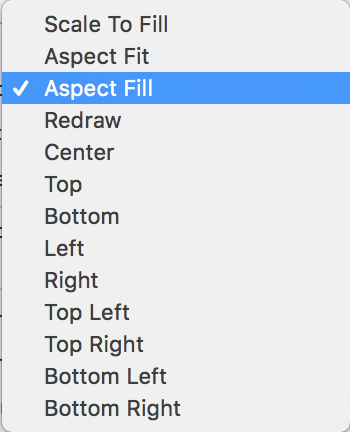

# swift-addressbookapp
iOS 레벨3 주소록 앱 저장소

> 시작하기 - UITableViewController

- ***학습꺼리***

1. 이미지 채우는 contentMode에 대해 학습한다.

: contentMode에는 위와 같은 여러가지 mode가 있는데 이 중에서 헷갈리는 3가지에 대해서 정리해본다.  
	1) Scale To Fill: 화면에 맞춰서 이미지의 가로, 세로를 늘린다.  
	2) Aspect Fit: 이미지를 늘리지 않고 화면에 딱 맞게 정렬한다.  
	3) Aspect Fill: 이미지를 늘리지 않고 화면에 꽉 채워서 정렬한다.  
	
2. UITableViewController를 활용해서 static cell을 디자인하는 방식을 학습한다.
: 

---

