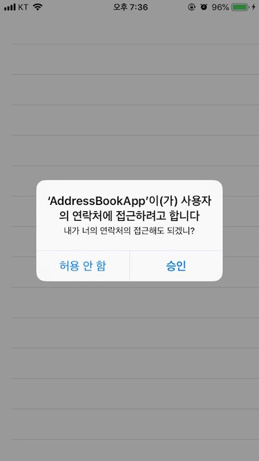

# swift-addressbookapp

# Step1
> TableViewController & Static Cells

### 첨부파일

# Step2
> UITableViewDataSource

### 첨부파일

# Step3
> Custom Cell & Setting Height

### 정리
1. 이전 단계보다 세밀한 작업을 위해 Holiday 모델을 추가하고 수정하였습니다. 
2. 높이는 UITableViewDelegate 안의 함수를 사용하여 지정해줍니다.
3. 2번에서 에러가 발생하는 경우, 만약 높이가 고정이라면 사이즈 인스펙터 탭을 열어 셀의 높이를 입력해줍니다.

### 첨부파일

# Step4
> Contact

### 정리
1. Privacy - Contacts Usage Description 접근 권한 여부 확인 ( in Info.plist ) 
2. tableView.reloadData() 를 사용해서 테이블 뷰 갱신 

### 첨부파일

# Step5
> Section Group & Index

### 작업내용
1. 그룹별 Section 사용
2. IndexTitle 사용 및 이동 가능
3. 필터링 : 배열에 filter함수 사용해서 필터링(오름차순) 하지않고 enum 을 이용하여 영어보다 한글이 먼저 오도록 함 
4. 영어는 대문자를 사용할 수 있도록 변경

### 정리
1. indexTitle 관련된 함수 중에 sectionForSectionIndexTitle 파라미터가 있는 함수는 index 를 리턴 바로해주면 되는데 Section 안에 데이터 개수를 넘기는 것으로 착각해서 많이 시간을 소비 

### 첨부파일

