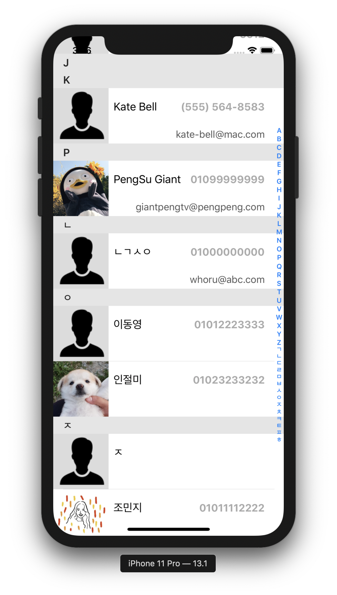

# swift-addressbookapp

iOS 레벨3 주소록 앱 저장소

[1. 앱 설계하기](#1---앱-설계하기)

[2. 섹션 정렬](#2---섹션-정렬)

## 1 - 앱 설계하기

### 요구사항 / 추가내용

- [애플 샘플 코드 - Managing Contacts](https://developer.apple.com/library/archive/samplecode/ManagingContacts/Introduction/Intro.html#//apple_ref/doc/uid/TP40017031) 에서 MGCContactStore 클래스와 의존성이 있는 클래스를 프로젝트에 복사한다.
- 복사한 MGCContactStore 클래스 메소드를 활용해서 주소록에 있는 전체 Contacts 정보를 Fetch하고, TableViewDataSource에서 활용한다.

### 실행 결과

[⏫ TOP](#swift-addressbookapp)

## 2 - 섹션 정렬

### 요구사항 / 추가내용

- 주소록에 있는 전체 Contacts 정보를 Fetch한 다음에 성-이름 순으로 오름차순 정렬을 하고 sectionHeader를 이용해서 초성 단위로 section을 구분한다.
  - 데이터 구조 개선

- Section과 매칭해서 곧바로 원하는 위치로 스크롤해서 이동할 수 있도록 인덱스제목(indexTitle)을 지정한다.
  - 타이틀을 누르면 해당 Section으로 이동하도록 설정한다.

### 실행 결과

- - 