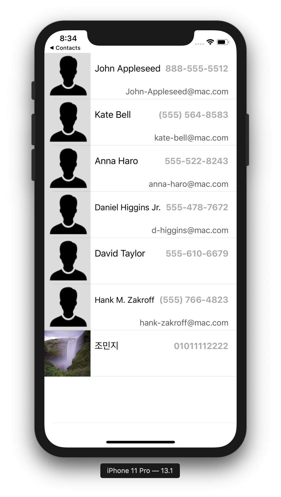

# swift-addressbookapp
iOS 레벨3 주소록 앱 저장소

## 1 - 앱 설계하기

### 요구사항 / 추가내용

- [애플 샘플 코드 - Managing Contacts](https://developer.apple.com/library/archive/samplecode/ManagingContacts/Introduction/Intro.html#//apple_ref/doc/uid/TP40017031) 에서 MGCContactStore 클래스와 의존성이 있는 클래스를 프로젝트에 복사한다.
- 복사한 MGCContactStore 클래스 메소드를 활용해서 주소록에 있는 전체 Contacts 정보를 Fetch하고, TableViewDataSource에서 활용한다.

### 실행 결과

