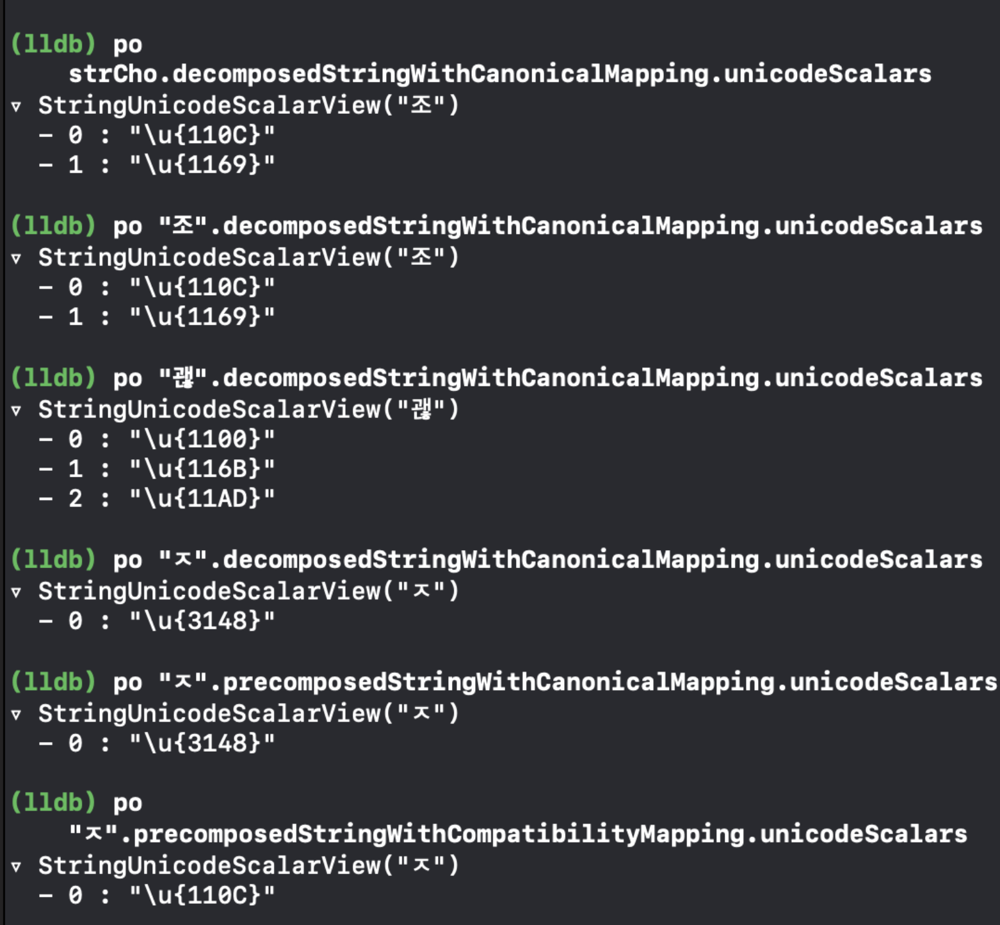
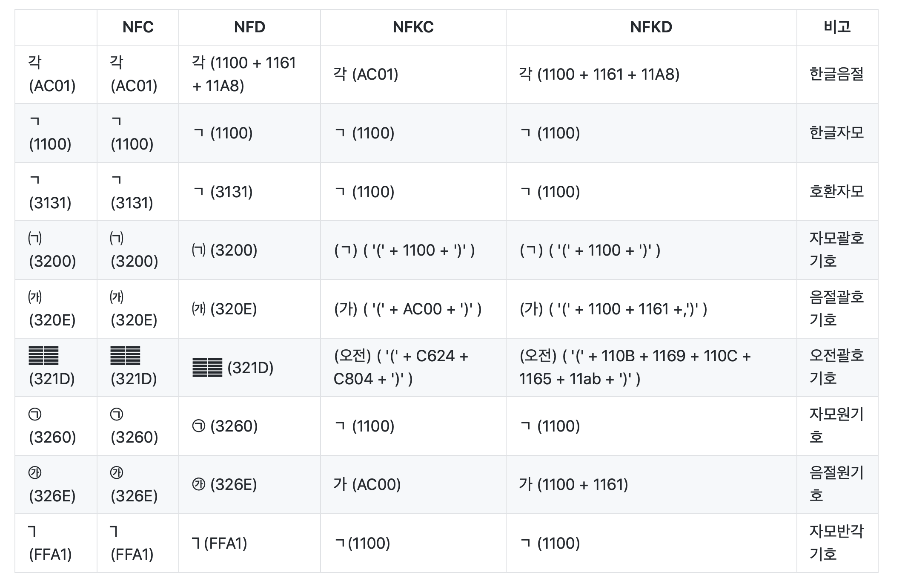

# swift-addressbookapp

iOS 레벨3 주소록 앱 저장소


[1. 앱 설계하기](#1---앱-설계하기)

[2. 섹션 정렬](#2---섹션-정렬)


## 1 - 앱 설계하기

### 요구사항 / 추가내용

- [애플 샘플 코드 - Managing Contacts](https://developer.apple.com/library/archive/samplecode/ManagingContacts/Introduction/Intro.html#//apple_ref/doc/uid/TP40017031) 에서 MGCContactStore 클래스와 의존성이 있는 클래스를 프로젝트에 복사한다.
- 복사한 MGCContactStore 클래스 메소드를 활용해서 주소록에 있는 전체 Contacts 정보를 Fetch하고, TableViewDataSource에서 활용한다.

### 실행 결과


[⏫ TOP](#swift-addressbookapp)


## 2 - 섹션 정렬

### 요구사항 / 추가내용

- 주소록에 있는 전체 Contacts 정보를 Fetch한 다음에 성-이름 순으로 오름차순 정렬을 하고 sectionHeader를 이용해서 초성 단위로 section을 구분한다.
  - 데이터 구조 개선

- Section과 매칭해서 곧바로 원하는 위치로 스크롤해서 이동할 수 있도록 인덱스제목(indexTitle)을 지정한다.
  - 타이틀을 누르면 해당 Section으로 이동하도록 설정한다.


### 실행 결과


### 문제 / 해결

- 유니코드 정규화 방식으로 인한 문제 

  - 유니코드 스트링에서는 같은 문자더라도 두 가지 방법으로 표현될 수 있다. 
    같은 "ㄱ" 이더라도 precomposed / decomposed 방식에 따라 다른 ㄱ이 될 수 있다.

  - precomposed는 `각` 을 한 문자로 저장하고 decomposed는 `ㄱ ㅏ ㄱ` 이런식으로 분해해서 저장한다.

  - 윈도우에서 저장한 파일을 맥으로 가져와보면 ㅍㅏㅇㅣㄹㅇㅣㄹㅡㅁ 이 이런식으로 깨지는 경우가 있다. 이런 것이 이 문제로 인한 것! 

    

  - 처음에는 유니코드, 한글 문자 순서, 한글초성 순서를 이용해 초성을 구했다.
    `let consonant = (firstWord - 0xAC00) / (21 * 28) + 0x1100` 

  - 참고 https://cfdf.tistory.com/45

    

  - 조민지, 김펭수 와 같이 완전한 이름(?)으로 구성되어 있는 경우 문제 없이 구해졌지만
    ㅈㅁㅈ, ㄱㅍㅅ 와 같이 초성으로 이름이 저장되어 있으면 초성을 구할 수 없었다.

  - 

  - "조"는 U+110C, U+1169로 이루어져있다 

  - "ㅈ"는 U+3148로 이루어져있음....................

  - 

  - 맥에서는 파일명을 저장할 때 NFD 방식 (한글 자모를 따로따로 받아 조합하는 방식) 으로 정규화를 한다.

  - 그래서 "ㅈ"만 하면 3148이 나오는 것,,, 당연히 기존의 방식(한글순서 이용)은 NFC/NFKC 를 이용한 것이기 때문에 다른 유니코드가 나오는 것이다.

- **해결**

  - Swift에서 유니코드 mapping을 지원해주는 함수

  - 

  - "ㅈ"가 들어온 경우: "ㅈ"을 합친다. (이미 분해되어있기때문에 U+110C가 아니라 U+3148임)

    - (precomposedStringWithCompatibilityMapping : NFKC로 변경)

  - "조"가 들어온 경우: "조" 를 분해한다. -> "ㅈ" "ㅗ" // AC~ -> U+110C , U+1169

    - (decomposedStringWithCanonicalMapping: NFD로 변경) 를 해준다.
    - 초성은 "ㅈ" 이니까 first를 가져온다.

  - 정리해보면 NFKC로 형식을 맞춰준 다음 NFD로 글자를 쪼개고 그 후, 첫번째 글자를 가져오면 된다.

  - ```swift
       func initialConsonant() -> String? {
            guard let firstWord = self.first else { return nil }
            let wordWithKCForm = String(firstWord).precomposedStringWithCompatibilityMapping
            guard let consonant = wordWithKCForm.decomposedStringWithCanonicalMapping.unicodeScalars.first else { return nil }
            return UnicodeScalar(consonant).description
        }
    ```

- 참고링크
  - https://gist.github.com/Pusnow/aa865fa21f9557fa58d691a8b79f8a6d
  - https://velog.io/@leejh3224/번역-유니코드-스트링을-노멀라이징-해야하는-이유
  - https://beankhan.tistory.com/103
  - https://www.objc.io/issues/9-strings/unicode/#normalization-forms

[⏫ TOP](#swift-addressbookapp)

