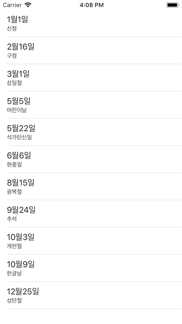
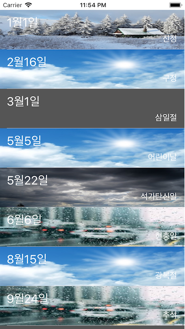

# swift-addressbookapp

# Step1
> TableViewController & Static Cells

### 첨부파일

# Step2
> UITableViewDataSource

### 첨부파일

# Step3
> Custom Cell & Setting Height

### 정리
1. 이전 단계보다 세밀한 작업을 위해 Holiday 모델을 추가하고 수정하였습니다. 
2. 높이는 UITableViewDelegate 안의 함수를 사용하여 지정해줍니다.
3. 2번에서 에러가 발생하는 경우, 만약 높이가 고정이라면 사이즈 인스펙터 탭을 열어 셀의 높이를 입력해줍니다.

### 첨부파일

# Step4
> Contact & MGC Framework

### 정리
1. Privacy - Contacts Usage Description 접근 권한 여부 확인 ( in Info.plist ) 
2. tableView.reloadData() 를 사용해서 테이블 뷰 갱신 
