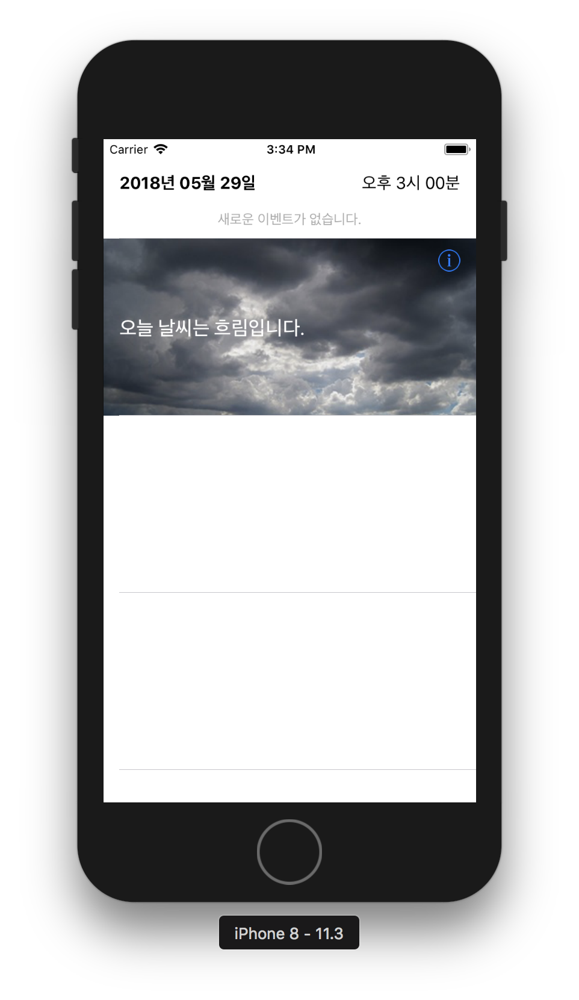
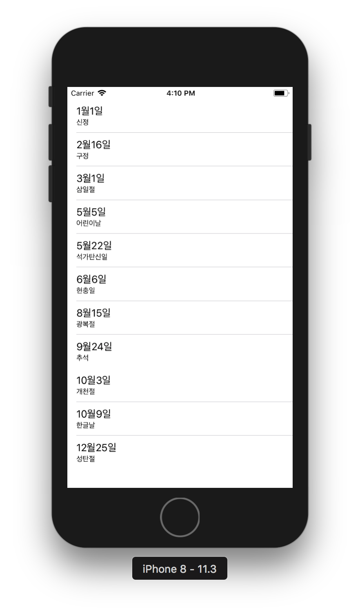

# 구현화면

## Step1
- 완성: 2018.05.29

## Step2
- 완성: 2018.06.03

# 공부한 것 & 알게된 것들

## 테이블뷰와 셀 스타일 기본

### 테이블뷰 생성
- 스토리보드에서 UITableViewController 추가하여 이용
- 코드로는 커스텀 클래스에 UITableViewDataSource와 UITableViewDelegate 프로토콜 구현하여 테이블뷰컨트롤러로 이용
- 커스텀 클래스를 따로 프로토콜을 구현하지않고 프로젝트 내에 파일 추가시 Cocoa Touch Class를 선택하여 UITableViewController를 추가하는 방법도 있다.
  - 참고: `class UITableViewController : UIViewController, UITableViewDelegate, UITableViewDataSource`

### Static Cells / Dynamic Prototypes
테이블뷰의 특성은 동적 프로토타입 / 정적 셀 이 있다. 새로운 테이블뷰를 생성할 때 기본 설정 값은 동적 프로토타입이다.
- Dynamic Prototypes (동적 프로토타입)
  - 행(셀)의 개수가 고정되어있지 않는 테이블뷰에 사용.
  - 앱이 실행되는 도중 상태가 바뀌면 (ex. 사용자가 목록에서 항목을 삭제하거나 추가하는 행동을 할때) 셀의 개수가 상황에 따라 변경된다.
  - UITableViewDataSource 인스턴스에 의해 콘텐츠를 관리
  - 셀 하나를 디자인해 이를 다른 셀의 템플릿으로 사용
- Static Cells (정적 셀)
  - 말그대로 정적. 고정된 레이아웃과 행(셀)의 수를를 가지는 테이블뷰에 사용한다.
  - 테이블뷰를 만드는 시점에 테이블의 형태와 셀의 수가 정해져있는 경우 사용한다. 앱이 실행되면서 상태가 바뀐다고해서 테이블뷰의 셀의 수가 변화되거나 하지 않는다.

### 테이블뷰 스타일
- plain
  - 하나 이상의 섹션을 가질 수 있음
  - 섹션 또한 하나 이상의 열(row)을 가질 수 있고, 각 섹션은 header와 footer를 가질 수 있음
  - (헤더와 섹션에 이미지를 넣고싶으면 커스텀뷰를 가지게 할 수도 있다.)
  - indexed list : 주소록처럼 인덱스가 섹션의 헤더 타이틀이고 오른쪽 스크롤에 인덱스가 표시됨
  - selection list
- grouped
  - 섹션이 그룹핑되어있는 형태로, 각각의 섹션이 시각적으로 구분되어 보임
  - 구분된 섹션은 회색으로 배경이 처리되고 그룹 내의 셀들은 흰색 배경

### 셀 스타일
- 테이블에서 열(row)형태로 그려진 셀. 셀 스타일은 네가지가 제공된다.
- [UITableViewCell](https://developer.apple.com/documentation/uikit/uitableviewcell)클래스를 이용하여 셀의 content와 background를 관리한다.
- 가장 간단한 방법은 predefined styles을 사용하는 것이다.
  - [UITableViewCellStyleDefault](https://developer.apple.com/documentation/uikit/uitableviewcellstyle/default): 왼쪽에 이미지, 이미지 옆은 타이틀 한개 있는 형태
  - [UITableViewCellStyleSubtitle](https://developer.apple.com/documentation/uikit/uitableviewcellstyle/subtitle): default스타일과 동일하지만 타이틀 아래에 subtitle(상세 설명. 작은 글씨)이 있는 형태
  - [UITableViewCellStyleValue1](https://developer.apple.com/documentation/uikit/uitableviewcellstyle/uitableviewcellstylevalue1): 이미지가 없고 셀 왼쪽에 타이틀이 있고 오른쪽에 subtitle이 있는 형태. 이미지를 넣을 수 없다.
  - [UITableViewCellStyleValue2](https://developer.apple.com/documentation/uikit/uitableviewcellstyle/value2): 마찬가지로 이미지를 넣을 수 없으며, 셀 왼쪽에 subtitle이 있고 오른쪽에는 description이 있는 형태.

- [테이블 뷰 셀에 대한 상세설명 - Table View Programming Guide - A Closer Look at Table View Cells ](https://developer.apple.com/library/content/documentation/UserExperience/Conceptual/TableView_iPhone/TableViewCells/TableViewCells.html#//apple_ref/doc/uid/TP40007451-CH7-SW1)

### 악세서리 뷰
accessory-type constants로 제공되는 세 개의 표준 뷰가 있다.

- [이미지 출처 - Table View Programming Guide](https://developer.apple.com/library/content/documentation/UserExperience/Conceptual/TableView_iPhone/TableViewStyles/TableViewCharacteristics.html#//apple_ref/doc/uid/TP40007451-CH3-SW1)

## 테이블뷰 API

### Table View - 테이블뷰
- TableView는 UITableViewClass의 인스턴스이다.
- UITableViewClass의 메소드를 통해 테이블뷰의 외관(appearance)을 설정할 수 있다.
  - (for example, specifying the default height of rows or providing a subview used as the header for the table)
- 또 다른 메소드로는 현재 선택된 열(row), 특정한 열이나 셀에 접근할 수 있다.
- 메소드로는 선택된 셀을 관리하고, 뷰를 스크롤하거나, 열이나 섹션을 추가하거나 제거할 수 있다.
- UITableView는 UIScrollView를 상속받아 스크롤링을 구현하는데, 테이블뷰는 특별하게 수직적 스크롤링(vertical scrolling)만 허용된다.

### Table View Controller - 테이블뷰 컨트롤러
The UITableViewController class manages a table view and adds support for many standard table
- UITableViewController 클래스는 테이블뷰를 관리하는 동작을 한다. 선택 관리(selection management), 열 수정, 테이블 설정 등의 동작들과 관련해서 테이블뷰를 서포트한다.
- 테이블뷰컨트롤러를 직접적으로 사용하지는 않고, UITableViewController를 상속받아서 커스텀클래스를 구현한다.

### Data Source and Delegate - 데이터소스와 델리게이트
- 테이블뷰를 사용하기위해서는 Data Source and Delegate를 반드시 구현해야한다.
- MVC패턴에 따라, data source는 앱의 model과 table view의 중간자 역할을 한다.
- Delegate는 테이블뷰의 동작과 출현(appearance)을 담당한다. view가 변경되는 사항을 델리게이트가 담당하고, 뷰는 그 델리게이트에 의존하여 뷰를 업데이트한다.
- Data source와 Delegate는 같은 객체일수 있고,(한 클래스에서 구현할 수도 있고) 그 클래스는 UITableViewController를 상속받는다.
- Data source는 UITableViewDataSource프로토콜을 따른다.
- Delegate는  UITableViewDelegate프로토콜을 따르며, required메소드는 없고 optional메소드를 필요에 따라 구현하면 된다.

### IndexPath Class
- Swift에서는 NSIndexPath 대신 IndexPath를 사용.
- 테이블뷰의 메소드들은 Indexpath를 파라미터나 리턴밸류로 사용한다.
- 셀을 index path를 이용하여 정렬할때 사용한다.
- index path는 중첩된 어레이(이중배열, nested array)의 특정한 노드로 가는 경로를 확인하고(identify), foundation프레임워크 내에서는 [NSIndexPath](https://developer.apple.com/documentation/foundation/nsindexpath)클래스이다.
- IndexPath의 section과 row: 행렬형태로 이해하고 보면 쉬움
  - section: 셀이 위치해야할 섹션. (The section in the table that the cell is going to be placed into.)
  - row: 섹션 내에서의 셀의 위치(순서) (The row (in the section) that the cell will be placed into.)
  - [참고링크 - Stackoverflow](https://stackoverflow.com/questions/28178030/what-does-indexpath-row-return)

### Table View Cells - 테이블뷰 셀
- 셀은 UITableViewCell클래스를 상속받는다.
- UITableViewCell클래스는 셀 선택과 편집, 악세서리 뷰 관리, 셀 설정(configuration) 메소드를 제공한다.
- predefined style을 이용해서 미리 정의된 스타일로 셀을 설정 할 수 있음
- 이미 기존에 있는 셀(“off-the-shelf” cell object)에 커스텀서브뷰를 올려서 구현할 수도 있다.
- UITableViewCell클래스를 상속받은 커스텀뷰를 만들어서 셀의 외관(appearance)이나 동작을 만들 수도 있다.
- [테이블뷰 셀에 대한 더 자세한 내용 - A Closer Look at Table View Cells](https://developer.apple.com/library/content/documentation/UserExperience/Conceptual/TableView_iPhone/TableViewCells/TableViewCells.html#//apple_ref/doc/uid/TP40007451-CH7-SW1)
