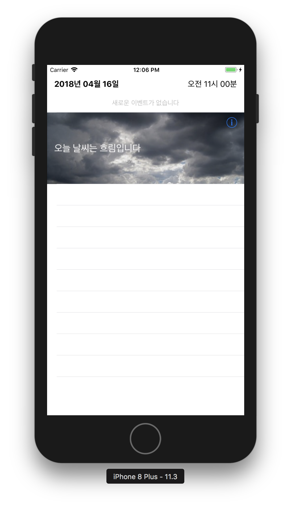
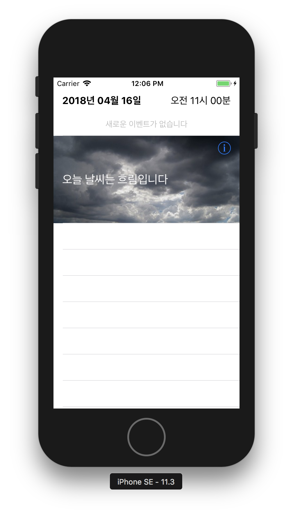
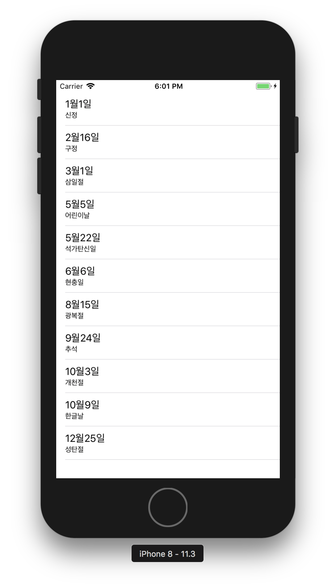
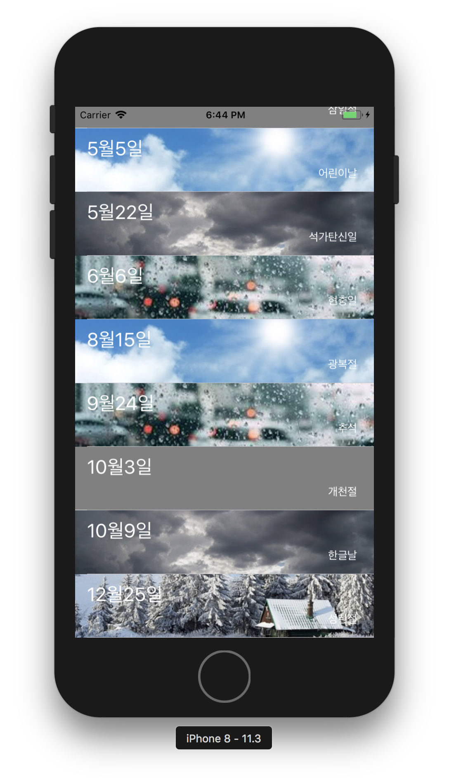
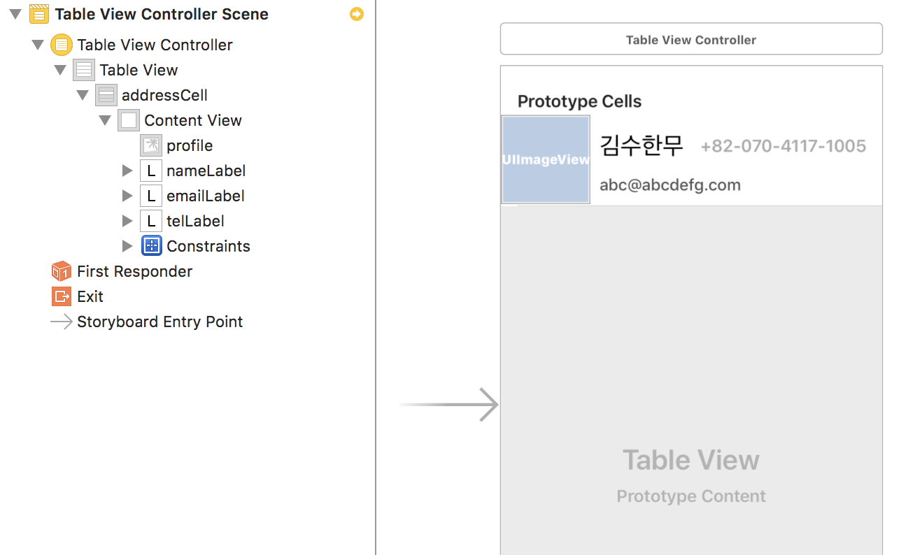
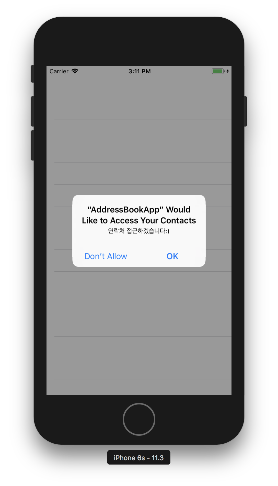
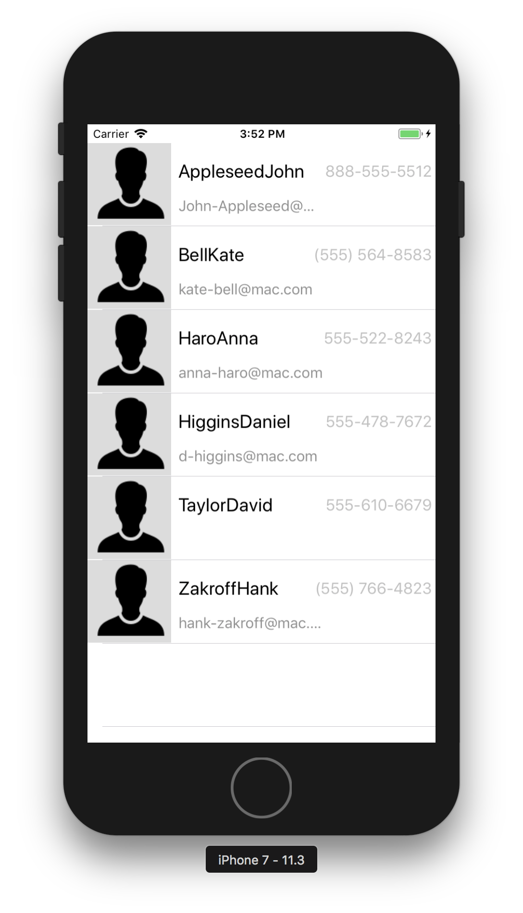

# 주소록앱

### 1. 시작하기 - UITableViewController

##### 프로그래밍 요구사항
* 스토리보드에 새로운 TableViewController를 추가하고, Initial ViewController로 지정함
* DateTimeCell 부분을 다음과 같이 디자인함
    * 셀 높이는 80으로 지정함
    * 가이드라인에 맞춰서 윗 부분에는 dateLabel과 timeLabel 이 폭을 2등분함
    * dateLabel은 좌측 정렬, timeLabel은 우측 정렬함
    * dateLabel과 timeLabel 높이는 24보다 크고 절반을 차지함
    * 그 아래 eventLabel가 위치하고 높이는 20보다 크고 나머지 영역을 차지함
* eventLabel 내용은 가운데 정렬하고, 글자 크기는 14, 글자색은 회색
    * WeatherCell 부분을 다음과 같이 디자인함
    * UIImageView로 셀 전체에 배경 이미지를 지정함
    * 이미지는 에셋에 추가한 4장 중에 하나로 선택하고, contentMode를 aspectToFill 로 지정함
    * 그 위에 weatherDescription 과 detailButton을 위치함
    * weatherDesciption 글자 크기는 20, 글자색은 흰색으로 지정함
    * 설명은 배경 이미지에 맞춰서 문구를 지정함

##### 실행결과

</img>
</img>

##### 학습거리
* 이미지 채우는 contentMode에 대해 학습함
* UITableViewController를 활용해서 static cell을 디자인하는 방식을 학습함

### 2. DataSource 객체

##### 프로그래밍 요구사항
* 스토리보드에 새로운 ViewController (Scene)를 추가하고, Initial ViewController로 지정함
* 새로 추가한 ViewController.View에 TableView를 추가하고 화면 가득하게 채움
    * TableView.Content 속성은 Dynamic Prototypes 로 지정하고, Prototype Cells는 1로 설정함
    * 셀 프로토타입 Style은 Subtitle로 지정하고, reuse identifier 속성에 id를 고유한 값으로 지정함
* UIViewController 에서 상속받아 새로운 뷰컨트롤러 클래스 HolidayViewController를 만들고, 스토리보드 ViewController의 Custom Class로 지정함
    * TableView를 HolidayViewController 클래스의 IBOutlet으로 연결함
    * TableView.dataSource를 HolidayViewController로 지정함
* 다음과 같은 JSON 데이터를 HolidayViewController 코드에 추가하고 JSONSerialization을 활용해서 Array<Dictionary<String,String>> 타입으로 변환함

```
[{"date":"1월1일", "subtitle":"신정"},
{"date":"2월16일", "subtitle":"구정"},
{"date":"3월1일", "subtitle":"삼일절"},
{"date":"5월5일", "subtitle":"어린이날"},
{"date":"5월22일", "subtitle":"석가탄신일"},
{"date":"6월6일", "subtitle":"현충일"},
{"date":"8월15일", "subtitle":"광복절"},
{"date":"9월24일", "subtitle":"추석"},
{"date":"10월3일", "subtitle":"개천절"},
{"date":"10월9일", "subtitle":"한글날"},
{"date":"12월25일", "subtitle":"성탄절"}]
```

* HolidayViewController에 UITableViewDataSource 프로토콜을 채택하고 필수 메소드를 구현함
    * cell.textLabel 에는 date 값을 출력하고, cell.subtitle 에는 subtitle 값을 출력함

##### 실행결과

</img>

##### 학습거리 
* UITableViewController와 UIViewController에 UITableView를 추가한 차이를 학습함
* DataSource 프로토콜을 구현하기 위한 필수 메소드 형식과 동작 방식을 정리함
* Delegate 패턴과 DataSource 프로토콜과 비슷한 점, 차이점은 무엇인지 학습함

##### 피드백
* 고치기 전
    * 모델 클래스가 뷰를 알거나 델리게이트 메소드를 그대로 가져올 필요는 없어요. 그럴거면 DataSource 역할을 하는 객체를 따로 만드는게 좋습니다.
    * Cell을 채우는 코드는 차라리 Cell 내부에 구현하고, Cell에게는 필요한 데이터만 넘기세요. 
    * 만약 ViewController가 DataSource 역할을 할꺼면 holidays: [Holiday] = [Holiday]() 를 대체하는 객체만 만들고,
    * DataSource 프로토콜을 구현하는 메소드에서 모델 객체에 필요한 데이터만 요청해서 받아서 Cell을 채우세요.
    
```swift
class HolidayViewController: UIViewController {
    @IBOutlet weak var tableView: UITableView!
    private var holidays: [Holiday] = [Holiday]()

    // ...
}

class HolidayBox {
    private var holiday: Holiday
    
    init(_ holiday: Holiday) {
        self.holiday = holiday
    }
    
    func cell(_ tableView: UITableView, indexPath: IndexPath) -> UITableViewCell {
        let cell = tableView.dequeueReusableCell(withIdentifier: ViewProperties.holidayTableCell, for: indexPath)
        cell.textLabel?.text = holiday.date
        cell.detailTextLabel?.text = holiday.subtitle
        return cell
    }
}
```

* 고친 후
    * 피드백에 대해 제대로 이해하지 못함
    * `HolidayViewController가 [Holiday]를 직접 가지고 있는게 아니라 [Holiday]를 가지고 있는 HolidayDataManager 객체가 가지고 있는 속성이나 함수를 통해 접근해야 함`
    * 예전에 자판기 앱 했을 때 동일한 작업인데, 놓치고 있었음. 프로토콜 이런 것보다 새로운 객체로 쪼갤 수 있다면 그렇게 처리하고 쉽게 생각하고 기본에 충실하자:)

```swift
class HolidayViewController: UIViewController {
    @IBOutlet weak var tableView: UITableView!

    // weak로 변수 선언해야 하는 것인가?
    // * HolidayViewController에서 사용한다면 굳이 weak로 선언할 필요가 없음. 다만 다른 곳에서 만든 것을 사용한다면 weak 선언이 필요함
    private var holidayDataManager: HolidayDataManager!
    private let cellIndentifier = "Cell"
    
    override func viewDidLoad() {
        super.viewDidLoad()
        self.tableView.dataSource = self
        
        holidayDataManager = HolidayDataManager().convert(HolidayJson.string)
    }
}

extension HolidayViewController: UITableViewDataSource {
    func tableView(_ tableView: UITableView, cellForRowAt indexPath: IndexPath) -> UITableViewCell {
        let cell = tableView.dequeueReusableCell(withIdentifier: cellIndentifier, for: indexPath)
        cell.textLabel?.text = holidayDataManager[indexPath.row].date
        cell.detailTextLabel?.text = holidayDataManager[indexPath.row].subtitle
        return cell
    }

    func tableView(_ tableView: UITableView, numberOfRowsInSection section: Int) -> Int {
        return holidayDataManager.count
    }
}
```

### 3. UITableViewCell 커스텀셀

##### 프로그래밍 요구사항
* HolidayViewController.TableView에 새로운 프로토타입 Cell을 추가하고, Custom 스타일로 지정함
* 추가한 Custom cell은 높이를 80으로 하고 다음과 같이 ImageView와 Label을 추가함
* UITableViewCell 에서 상속받는 HolidayTableViewCell 클래스를 추가하고 새로 추가한 셀의 Custom class로 지정한다.
    * Custom class 코드와 연결된 상태를 확인하고 각각 IBOutlet을 연결함
    * ImageView는 backgroundImageView로 셀 전체를 채움
    * dateLabel은 상단에 2/3를 차지하고, 글자크기는 24로 글자색은 흰색으로 지정하고 좌측 정렬함
    * subtitleLabel은 하단에 1/3을 차지하고, 글자크기는 17로 글자색은 흰색으로 지정하고 우측 정렬함
* 다음과 같은 JSON 데이터를 HolidayViewController 코드에 추가하고 JSONSerialization을 활용해서 Array<Dictionary<String,String>> 타입으로 변환함

```
[{"date":"1월1일", "subtitle":"신정", "image" : "snowy"},
{"date":"2월16일", "subtitle":"구정", "image" : "sunny"},
{"date":"3월1일", "subtitle":"삼일절"},
{"date":"5월5일", "subtitle":"어린이날", "image" : "sunny"},
{"date":"5월22일", "subtitle":"석가탄신일", "image" : "cloudy"},
{"date":"6월6일", "subtitle":"현충일", "image" : "rainny"},
{"date":"8월15일", "subtitle":"광복절", "image" : "sunny"},
{"date":"9월24일", "subtitle":"추석", "image" : "rainny"},
{"date":"10월3일", "subtitle":"개천절"},
{"date":"10월9일", "subtitle":"한글날", "image" : "cloudy"},
{"date":"12월25일", "subtitle":"성탄절", "image" : "snowy"}]
```

* UITableViewDataSource 프로토콜 구현 부분에서 cell을 HolidayTableViewCell 타입으로 변환해서 사용함
    * cell.dateLabel 에는 date 값을 출력하고, cell.subtitleLabel 에는 subtitle 값을 출력하고, backgroundImageView에는 image 값에 해당하는 이미지를 표시함
    * 만약 이미지가 없을 경우는 회색 배경이 보이도록 처리함

##### 실행결과 

</img>

##### 학습거리 
* 테이블뷰에서 자동으로 결정하는게 아니라 강제로 셀 높이를 지정하는 방법에 대해 학습함
* 셀 id별로 재사용하는 방식에 대해 학습함
* 커스텀 셀을 사용할 때 주의해야 할 사항들을 정리함

##### 피드백
* 커스텀 셀을 재사용하면서 셀이 가지고 있는 값을 초기화 하지 않아서 문제가 발생함. HolidayDataManager에서 Holiday 배열 값은 제대로 가지고 있었지만 TableView에서 이미지가 제대로 바인딩되지 않음. 부를때마다 초기값 셋팅이 필요함

```swift
class HolidayTableViewCell: UITableViewCell {
    // ...
    
    override func prepareForReuse() {
        self.weatherImageView.image = nil
        self.dateLabel.text = ""
        self.subtitleLabel.text = ""
    }

    // ...
}
```

* `viewDidLayoutSubviews` 는 View Controller의 View Bounds가 변화할 때 호출함. `reloadData` 트리거가 일어나지 않음


##### UITableView, UITableViewController
* [정리](https://wiki.yuaming.com/ios/tableview-controller.html)

### 4. Contacts 프레임워크 적용

##### 프로그래밍 요구사항
* 다운로드 받은 샘플에서 MGCContactStore 클래스와 의존성이 있는 클래스를 최소로 함께 프로젝트에 복사함
* 스토리보드에 새로운 TableViewController를 추가하고, Initial ViewController로 지정함
* UITableViewController 에서 상속받아 새로운 뷰컨트롤러 클래스 AddressBookViewController를 만들고, 스토리보드 TableViewController의 Custom Class로 지정함
* 복사한 MGCContactStore 클래스 메소드를 활용해서 주소록에 있는 전체 Contacts 정보를 Fetch하고, TableViewDataSource에서 활용함
* 새로 추가한 TableViewController 속성에서 Content 값을 Dynamic Prototypes로 변경하고 Custom 셀을 추가함
* 추가한 Custom cell은 높이를 90으로 하고 다음과 같이 ImageView와 Label 3개를 추가함

</img>

* UITableViewCell 에서 상속받는 AddressTableViewCell 클래스를 추가하고 새로 추가한 셀의 Custom class로 지정함
    * 셀 Identifier는 addressCell 로 지정함
    * Custom class 코드와 연결된 상태를 확인하고 각각 IBOutlet을 연결함
    * ImageView는 profileImageView로 셀 좌측에 정사각형으로 고정함
    * nameLabel은 상단에 높이 2/3를 차지하고, 글자크기는 24로 글자색은 검정색으로 지정하고 좌측 정렬함
    * telLabel은 nameLabel과 동일한 높이에, 글자크기는 17로 글자색은 옅은 회색으로 지정하고 우측 정렬함
    * emailLabel은 하단에 1/3을 차지하고, 글자크기는 16로 글자색은 진한 회색으로 지정하고 좌측 정렬함
* 주소록 정보 중에 다음과 같이 셀에 표시함
    * cell.nameLabel 에는 lastName + firstName 값을 출력하고, cell.telLabel 에는 phoneNumber 값을 출력하고, cell.emailLabel에는 email 값을 출력하고, profileImageView에는 profilePicture.imageData 를 이미지로 표시함
    * 만약 프로필 이미지가 없을 경우는 다음 이미지가 보이도록 처리함

    

* 애플 샘플 코드를 분석하고, 일부 코드를 활용하는 방식을 학습함

##### 실행결과

</img>
</img>

##### 학습거리
* [Contacts](https://developer.apple.com/documentation/contacts)
* [Introducing the Contacts Framework for iOS and OS X](https://developer.apple.com/videos/play/wwdc2015/223/)
* [샘플코드](https://developer.apple.com/library/content/navigation/#section=Resource%20Types&topic=Sample%20Code)
* Info.plist
    * Privacy - Contacts Usage Description 설정하는 법 
* Contacts 샘플 코드 분석하면서 새롭게 알게 된 점
    * DispatchQueue 
    * MARK 사용 기준
    * 객체 역할 
    * 폴더 관리        